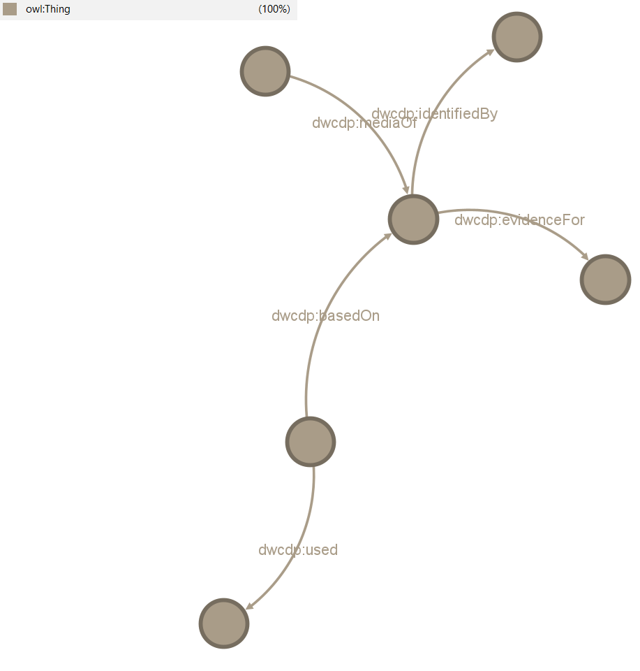
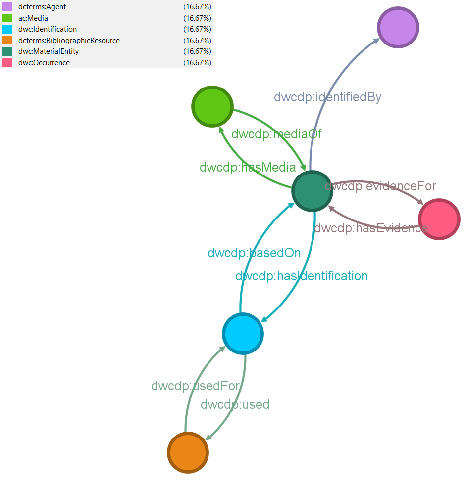
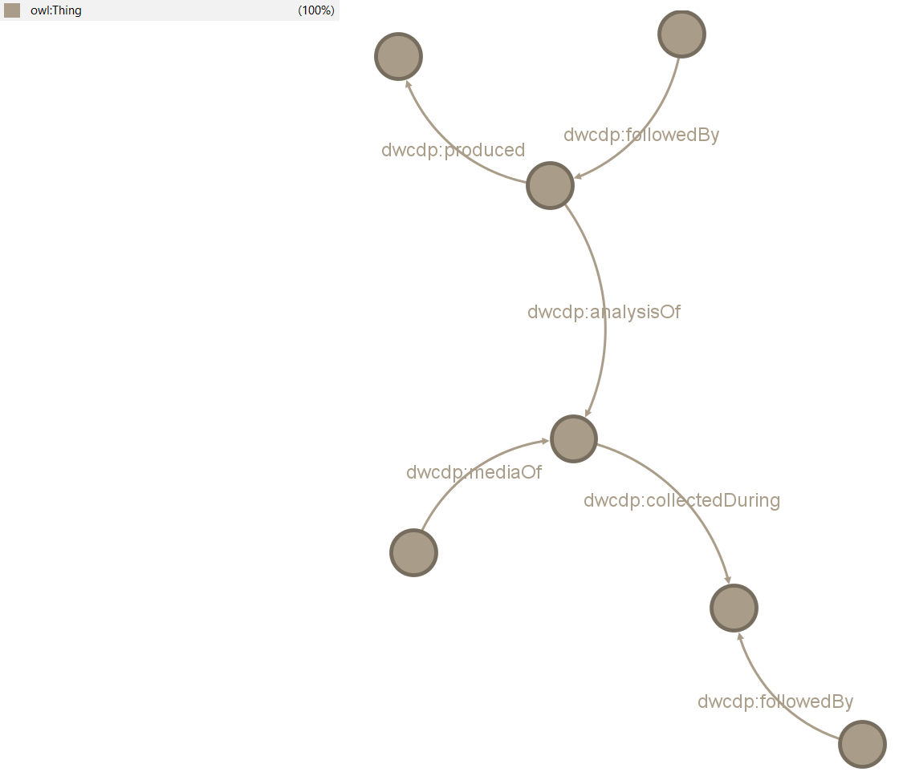
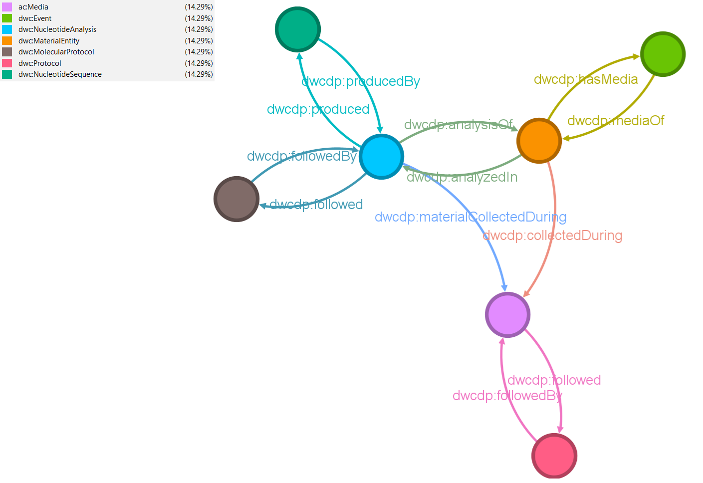
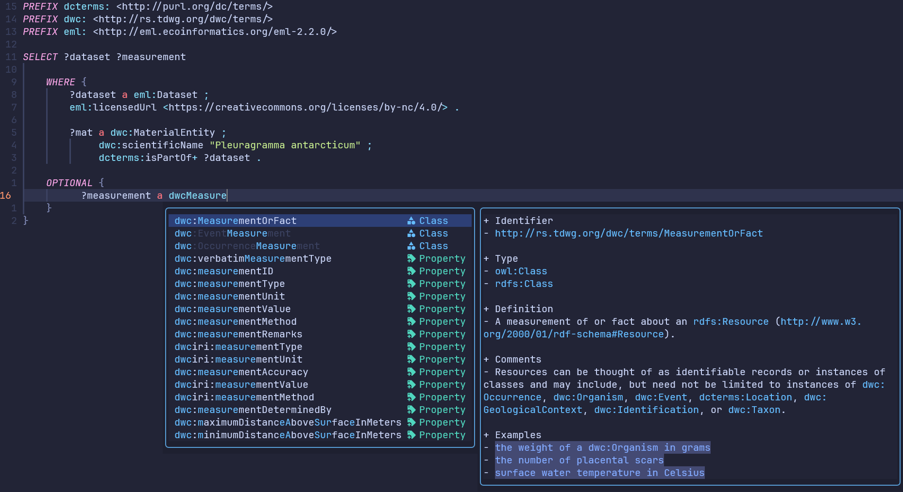

# DwC-OWL

## Intent of the project

The project seeks to convert [Darwin Core](https://dwc.tdwg.org/list/) and recently suggested [Darwin Core DataPackage](https://www.gbif.org/composition/3Be8w9RzbjHtK2brXxTtun/introducing-the-darwin-core-data-package) terms into OWL concepts of classes and properties.

Darwin-SW has previously explored similar ideas using OWL classes. This work extends that approach by incorporating OWL restrictions and additional object properties. The goal is to interlink entities through these object properties, creating a semantically connected network of biodiversity data rather than a simple, flat RDF representation.

The goal of the project is to provide researchers with a semantically-sound ontology to annotate biodiversity datasets. The advantages of this include, but are not limited to:

1. Enhanced data discoverability
2. Proper attribution of credits to reseachers
3. Improved dataset querying, promoting data reuse
4. Easier data publication processes to biodiversity aggregators (GBIF, OBIS)
5. Direct integration into pipelines that allow the computation of biological indicators

## Ontology exploration

The easiest way to explore the ontology is to look at the `dwc-owl.html` file in the `docs/` directory for a complete listing of the terms considered in the ontology. The documentation for this ontology can be viewed on the [GitHub Pages site of this repository](https://aminem0.github.io/dwc-owl/).

Alternatively, a visual representation of the classes and their relationships through object properties can be viewed [using WebVOWL](https://service.tib.eu/webvowl/#iri=https://raw.githubusercontent.com/aminem0/dwc-owl/refs/heads/main/ontology/dwc-owl-v2.ttl).

You can also load the `dwc-owl.ttl` file into an ontology editor such as [Protégé](https://protege.stanford.edu/). The difference is that Protégé includes reasoners such as HermiT, that allow reasoning over the test individuals created at the end of the ontology.

On that note, the HermiT reasoner is used to assess and ensure the consistency of the ontology. Through DL reasoning, it ensures that the description logic is sound and correct. 

## The role of reasoners

### Introduction

The benefits and importance of an ontology, and of automated reasoning over that ontology, are often difficult to appreciate in the abstract. The value of an ontology does not lie primarily in forcing data into strict schemas, but in making implicit knowledge explicit in a controlled and inspectable way. When paired with a reasoner, an ontology provides a mechanism to derive new knowledge that is already logically implied by the data and the modeling choices, without requiring data providers to assert that knowledge manually.

The following examples illustrate this point using concrete biodiversity data scenarios, derived from actual datasets. Each story starts from a deliberately minimal RDF graph that captures only what is explicitly stated. The effect of applying a reasoner is then examined, highlighting what additional structure and meaning can be recovered, and why this matters for querying, integration, and reuse.

### Story 1

Consider for example the story around the following image:


*Image obtained from [the Zenodo record for the BROKE-West dataset](https://doi.org/10.5281/zenodo.14899069). Released as public domain under [CC0 1.0](https://creativecommons.org/publicdomain/zero/1.0/legalcode).*

  The media is a photo of an Antarctic lanternfish (*Electrona antarctica*). It is a photo of preserved specimen, not of the fish as it occurred during its capture. This fish was identified by a researcher by the name of Anton Van de Putte, who used the book `Fishes of the Southern Ocean` as a taxonomic reference.

  These statements can be expressed using an ontology together with Darwin Core terms. At this stage, the goal is not to encode every possible detail, but to capture only the relationships that are explicitly known. This results in the following turtle file:

  ```turtle
  @prefix dwcdp: <http://rs.tdwg.org/dwcdp/terms/> .

  <http://bioboum.ca/identification/0ace24a7-2a0d-4f5f-903e-215a43aed359> dwcdp:basedOn <http://bioboum.ca/material/bc044ff4-3896-4617-9829-2f2345255887> ;
      dwcdp:identifiedBy <https://orcid.org/0000-0003-1336-5554> ;
      dwcdp:used <https://archive.org/details/fishesofsouthern00gono> .

  <https://zenodo.org/records/14899069/files/AAV3FF_00249_01.JPG> dwcdp:mediaOf <http://bioboum.ca/material/bc044ff4-3896-4617-9829-2f2345255887> .

  <http://bioboum.ca/material/bc044ff4-3896-4617-9829-2f2345255887> dwcdp:evidenceFor <http://bioboum.ca/occurrence/e4ea05b4-3b87-4f49-8797-5629b9bfa578> .
  ``` 

  As can be seen, the file is quite sparse. It contains only the object property assertions between entities explicitly mentionned in the text. In addition, it contains no `rdf:type` statements, meaning that the intended nature of each URI is not formally asserted. From a human point of view, one can get an idea (though this is dangerous), but from a machine point of view, no assumptions can be made.

  The researcher is identified using his ORCID identifier, and the reference book is identified using a persistent link from the Internet Archive. For the time being, entities such as the occurrence, the identification event, and the specimen itself are identified using URIs minted in a dummy namespace based on UUIDs, as placeholders. Later, the occurrence URI could be replaced by a GBIF or OBIS URI, and the specimen URI could be replaced by a collection-level identifier from the Institute of Natural Sciences, once accessioning is completed (as suggested by the entry for the property `dwc:disposition`).

  From a graph perspective, the situation can be represented as follows:

  

  In this initial graph, nodes are connected using simple links. In addition, none of the nodes are typed. In OWL terms, all resources are implicitly instances of `owl:Thing`, the most general class in the ontology, itself only a subclass of `rdfs:Resource`. The graph expresses what was said, but nothing more.

  This is where the ontology, together with a reasoner, becomes relevant. An ontology does not merely define terms, but also contains constraints and regularities about how those terms are intended to be used. When a reasoner is applied, these constraints allow new knowledge to be safely inferred from the existing statements, without requiring that knowledge to be asserted explicitly.

  After reasoning using the developped ontology, the data can be represented as the following, richer turtle file:

  ```turtle
  @prefix ac: <http://rs.tdwg.org/ac/terms/> .
  @prefix dcterms: <http://purl.org/dc/terms/> .
  @prefix dwc: <http://rs.tdwg.org/dwc/terms/> .
  @prefix dwcdp: <http://rs.tdwg.org/dwcdp/terms/> .
  @prefix dwciri: <http://rs.tdwg.org/dwc/iri/> .
  @prefix owl: <http://www.w3.org/2002/07/owl#> .

  <http://bioboum.ca/identification/0ace24a7-2a0d-4f5f-903e-215a43aed359> a dwc:Identification,
          owl:NamedIndividual ;
      dwciri:identifiedBy <https://orcid.org/0000-0003-1336-5554> ;
      dwcdp:basedOn <http://bioboum.ca/material/bc044ff4-3896-4617-9829-2f2345255887> ;
      dwcdp:identifiedBy <https://orcid.org/0000-0003-1336-5554> ;
      dwcdp:used <https://archive.org/details/fishesofsouthern00gono> .

  <http://bioboum.ca/occurrence/e4ea05b4-3b87-4f49-8797-5629b9bfa578> a dwc:Occurrence,
          owl:NamedIndividual ;
      dwcdp:hasEvidence <http://bioboum.ca/material/bc044ff4-3896-4617-9829-2f2345255887> .

  <https://archive.org/details/fishesofsouthern00gono> a dcterms:BibliographicResource,
          owl:NamedIndividual ;
      dwcdp:usedFor <http://bioboum.ca/identification/0ace24a7-2a0d-4f5f-903e-215a43aed359> .

  <https://zenodo.org/records/14899069/files/AAV3FF_00249_01.JPG> a ac:Media,
          owl:NamedIndividual ;
      dwcdp:mediaOf <http://bioboum.ca/material/bc044ff4-3896-4617-9829-2f2345255887> .

  <https://orcid.org/0000-0003-1336-5554> a dcterms:Agent,
          owl:NamedIndividual .

  <http://bioboum.ca/material/bc044ff4-3896-4617-9829-2f2345255887> a dwc:MaterialEntity,
          owl:NamedIndividual ;
      dwcdp:evidenceFor <http://bioboum.ca/occurrence/e4ea05b4-3b87-4f49-8797-5629b9bfa578> ;
      dwcdp:hasMedia <https://zenodo.org/records/14899069/files/AAV3FF_00249_01.JPG> .
  ```  

  Notice that this turtle file is considerably different from the previous. The first difference is that `rdf:type` statements have been inferred. For example, the URI identifying the researcher is now known to be a `dcterms:Agent`, the URI identifying the image is classified as `ac:Media` and the URI identifying the specimen is classified as a `dwc:MaterialEntity`. These types were not asserted directly, but were inferred from the use of specific properties whose domain and range were defined in the ontology.

  In addition, inverse object properties were also inferred. For example, if the image is a media of the specimen, then the specimen also has the image as a media representation. This inverse relationship is implicit, but was not stated earlier. This explicit mention of knowledge facilitates queries in various directions. Likewise, subproperty relationships between the terms in the ontology and those in the `dwciri:` namespace also become apparent.

  From a graph perspective, the result now looks like this:

  

  The graph is not only denser, but also semantically clearer. Nodes are no longer anonymous resources, but explicitly typed entities that can be interpreted consistently across datasets. This illustrates an important role of reasoners, which is to make explicit the knowledge that is already implicit in the data and the ontology.

### Story 2

Another story may be told around the following image:

  
  *Image obtained from the GBIF media cache, owned by the Natural History Museum of Denmark. Licensed under [CC BY-NC 4.0](https://creativecommons.org/licenses/by-nc/4.0/).*

  This is an image of of a material entity, namely of size sorted insects. This material was collected during an event, which followed a protocol, which consisted of driving back and forth predefined 5 km routes with a insect net mounted on the rooftop of their car. A metabarcoding sequencing of this material, according to a defined molecular protocol (IMP3) produced a nucleotide sequence that is `tctttcagcaaatgtgtcacatgccggcgcatctgtagacctagcaattttttcccttcacttagccgggatttcttccattctaggagctgtaaactttattacaacgattattaatatacgatctaatggaattacatttgaccgaatacccctatttgtatgatctgtccttattacggctattctattattgctatcatta`.

  Again, these statements can be expressed using an ontology together with Darwin Core terms, which results in the following turtle file:

  ```turtle
  ``` 

  Note that, as [the link from the Natural History Museum of Denmark](https://media.danbif.dk/media/insektmobil/P133.2BS_dry_2018_00L12S_03S.jpg) appears to be dead, the URI of the image is that of the GBIF cache. Dummy URIs are considered for most of the resources. Additional considerations could be taken, such as making the example more complex (e.g. considering the derivation steps from size-sorted insects to purified DNA extract) or by seeking more stable URIs, but these do detract from the example.

  Again, the turtle file is sparse, containing only the object properties directly asserted in the text. From a graph perspective, we are once more in a case where we only have loosely-connected data that has no `rdf:type` statements, as shown in the following graph:

  

  Once again, running the reasoner with the ontology on the dataset produces the following, richer turtle file:

  ```turtle
  ```

  Likewise, the graph is much more connected and has explicit `rdf:type` statements, as seen in the following graph:

  

  As with the previous example, the reasoned correctly inferred all instance types and the associated inverse properties. However, in addition to this, the graph and its associated turtle file show two additional things, that the previous example did not:

  1. There was an additional distinction between the Insektmobilen protocol and the IMP3 protocol. The Insektmobilen is typified as a `dwc:Protocol` instance, whereas the IMP3 is typified as a `dwc:MolecularProtocol` instance. This happened even though they both used the same object property `dwcdp:followedBy`. The distinction is based on the set of rules defined by the ontology, which allows the distinction of the two based on explicitly asserted knowledge and knowledge that can be inferred.
  
  2. An additional relationship between the nucleotide analysis and the event has been created. These are connected by the object property `dwcdp:materialCollectedDuring`. Even though this assertion was never explicitly mentionned, it was implied by the fact. Again, this inference of new knowledge is based on a particular set of rules defined in the ontology.
  
  In this second example, the inferred structure is not merely additive, but also discriminative. The reasoner does not only enrich the graph with more links and types, it also differentiates between conceptually similar entities based on their roles in the workflow. This highlights an often overlooked strength of reasoning, which is to recover semantic distinctions that were never explicitly asserted, but that follow necessarily from the modeling choices.

### Conclusion

  This added structure is what enables reliable querying, validation, and integration. Once entities are typed, SPARQL queries that target precise aspects of datasets, such as `retrieve all occurrences of Antarctic lanternfish that have media`, `list all agents involved in identifications` or `retrieve all occurrences whose identifications used bibliographic resources` no longer rely on conventions or documentation alone. Instead, they rely on formal semantics that can be applied consistently by machines.

  Beyond querying, reasoning also supports data validation and quality control. Inferred types and relationships can be checked against expectations, revealing modeling inconsistencies, missing assertions, or unintended uses of terms. In this way, reasoners act not only as knowledge expanders, but also as diagnostic tools.

  In this sense, reasoning allows minimally asserted, loosely structured RDF graphs to be transformed into interoperable knowledge graphs, while still allowing data providers to state only what they know with certainty. The ontology captures shared assumptions about the domain, and the reasoner makes those assumptions operational, bridging the gap between human understanding and machine-actionable knowledge.

  Importantly, these inferences do not introduce speculative knowledge. They are logical consequences of the ontology design: the class hierarchy, the property constraints, and the axioms that relate the resources. If any of these inferences were incorrect, the error would lie either in the ontology itself or in the original assertions, making such issues detectable and debuggable rather than silently embedded in downstream analyses. These highlight the importance of building a robust ontology, that not only accurately describes biological phenomena, but also allows the inferrence of additional knowledge in a structured and predictable manner.

## Initial motivation

The project was also motivated by another side-project: *sparql-completer*, a completion engine for sparql files. The neovim plugin is written in Lua and is based on a series of input Lua tables. The plugin can make calls to cURL, allowing for the direct execution of the SPARQL query, rather than through another programming language.



However, at its core, *sparql-completer* is only a completion engine, and therefore does not enforce any logical or datatype constraints. In other words, a nonsensical triple such as `bb:event123 dwcdp:happenedIn bb:identification456` will not get flagged as wrong even though it completely disregards, among other things, domain and range restrictions that I had written out. The SPARQL query will evidently (and silently) fail to retrieve any data.

The data in the triplestore follows the ontology I have described in *sparql-completer*, but does not validate it.

Therefore, I wanted to have a robust and consistent way to validate the underlying semantics. This is done by combining an OWL-based ontology and a SHACL-based validation of the constructed RDF graphs.

Originally, the semantics were more consistent with my original proposal, considering `foaf:Agent` and `foaf:Document` (which has the benefit of being equivalent to `bibo:Document`), but has been reworked to be compatible with the terms proposed by the Darwin Core DataPackage publishing model.

## Applications of the ontology

The terms in this ontology are being applied to model real-world datasets at [another GitHub repository](https://github.com/aminem0/dwc-owl-rdf).

## Ontology principles

### Designed for OWL-based semantics

The ontology was constructed explicitly to take advantage of OWL-based modelling. This includes the use of cardinality restrictions, existential restrictions, and other axioms that allow for precise semantic constraints. OWL class constructors, such as `owl:unionOf`, play an important role by enabling the natural expression of complex domain and range conditions, as well as other logical structures.

### Compatibility with external ontologies

A central design principle of this ontology is compatibility with established vocabularies and standards. This is achieved by aligning terms with those defined in other ontologies. These include, for example, declaring `dwcdp:spatialLocation` as a subproperty of `dcterms:spatial` and `dwcdp:createdBy` as a subproperty of `dcterms:creator`. Such alignments help ensure semantic interoperability, improve integration with external datasets, and support Linked Data best practices.

### Integration of controlled vocabularies

Beyond OWL classes and properties, many ontologies incorporate controlled vocabularies or thesauri. Controlled vocabularies are often represented as sets of `owl:NamedIndividuals`, while thesauri, such as those defined using SKOS, are typically collections of `skos:Concepts`. This ontology supports the integration of such vocabularies, enabling resources to be linked to domain-specific terms and researcher-defined concept schemes. This strengthens semantic clarity and enhances interoperability with external knowledge models.

### Built according to open science principles

The ontology is developed and maintained openly on GitHub to ensure full transparency and accessibility for the research community. Hosting the ontology in a public repository guarantees that all source files, documentation, and version histories are openly available. This approach not only facilitates reuse and verification but also encourages community engagement by enabling researchers to submit suggestions, report issues, and contribute constructive feedback. In this way, the ontology evolves through collaborative refinement consistent with open science practices.
